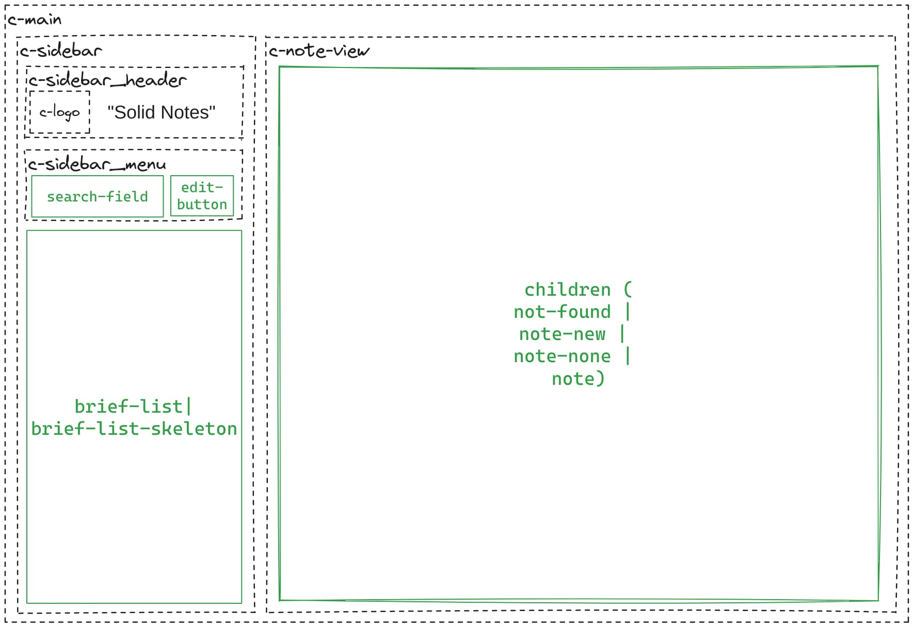
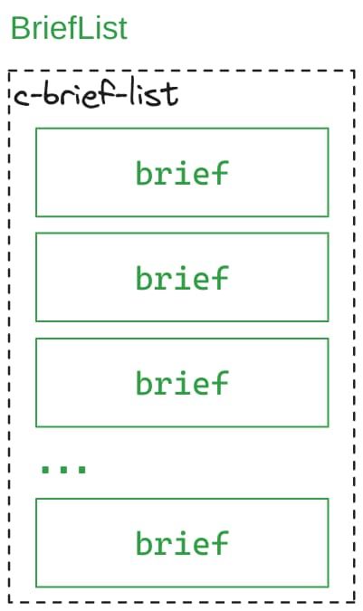
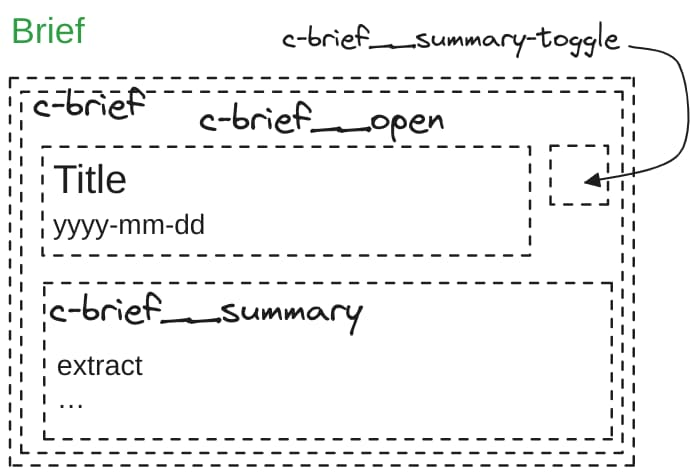

# SolidStart Notes (basic)

> … in a Zone … where we can get like a lot of the benefits of RSCs without RSCs …

— [Musing on HTML Partials](https://youtu.be/N-QwFFqI8aQ?t=12170)

> … you don't have to have server components to have the same benefits that server components give …

— [What Comes After GraphQL?](https://youtu.be/gfKrdN1RzoI?t=14516)

Updated for SolidStart v0.5.9 (new beta, [first beta version](https://github.com/peerreynders/solid-start-notes-basic/tree/2fe3462b30ab9008576339648f13d9457da3ff5f)). 
The app is a port of the December 2020 [React Server Components Demo](https://github.com/reactjs/server-components-demo) ([LICENSE](https://github.com/reactjs/server-components-demo/blob/main/LICENSE); [no pg fork](https://github.com/pomber/server-components-demo/), [Data Fetching with React Server Components](https://youtu.be/TQQPAU21ZUw)) but here it's just a basic client side routing implementation.
It doesn't use a database but stores the notes via the [Unstorage Node.js Filesystem (Lite) driver](https://unstorage.unjs.io/drivers/fs#nodejs-filesystem-lite) . This app is not intended to be deployed but simply serves as an experimental platform.


The longer term goal is to eventually leverage island routing to maximum effect once it's more stable and documented ([nksaraf](https://github.com/nksaraf) already demonstrated that [capability](https://github.com/solidjs/solid-start/tree/3f086d7660a6e29dea649e80ea5a7d2fc1ff5910/archived_examples/notes) ([live demo](https://notes-server-components.vinxi.workers.dev/)) with a non-standard branch of SolidStart).

---

## Route Design
The original's demo routing is managed by inside a single context ([`route.js`](https://github.com/reactjs/server-components-demo/blob/95fcac10102d20722af60506af3b785b557c5fd7/src/framework/router.js)) managing the following data:
- A content cache
- `location` consisting of:
    - `selectedId`
    - `isEditing`
    - `searchText`

This “triple” is used as a key to cache server content for that `location`.
The `location` is exposed in the URL as the [encoded URI component](https://developer.mozilla.org/en-US/docs/Web/JavaScript/Reference/Global_Objects/encodeURIComponent) value of the `location` [search parameter](https://developer.mozilla.org/en-US/docs/Web/API/URLSearchParams); e.g.:

```TypeScript
const location = { selectedId: 2, isEditing: false, searchText: '' };
const searchParams = new URLSearchParams([
  ['location', JSON.stringify(location)],
]);
const base = 'http://localhost:4000/react';
console.log(`${base}?${searchParams.toString()}`);
// "http://localhost:4000/react?location=%7B%22selectedId%22%3A2%2C%22isEditing%22%3Afalse%2C%22searchText%22%3A%22%22%7D"
console.log(`${base}?location=${encodeURIComponent(JSON.stringify(location))}`);
```

- `refresh(response)` purges/reinitializes the content cache within a [transition](https://react.dev/reference/react/startTransition); while the next rendering has been initiated with fresh data from the server, the existing UI remains intact, fully capable of interrupting the current render with another state update.

- `navigate(location)` updates the `location` state within a transition.

- The `useMutation` hook sends the `payload` associated with `location` to the `endpoint` then using the response to `refresh` the content cache. The hook's state reflects the status of the fetch (`isSaving`) and stores the last error.

It needs to be explicitly stated: the RSC demo *does **not** support [SSR](https://www.patterns.dev/react/server-side-rendering/)*. 
RSCs render [`ReactNodes`](https://github.com/DefinitelyTyped/DefinitelyTyped/blob/f1f24cebc663e157637c343ca61766d5a9e00384/types/react/index.d.ts#L424C1-L436C1) that can either be directly inserted into the client's vDOM or deliver prop values to client side components.
The vDOM diffing process then manipulates the DOM accordingly. At no point is there any HTML that needs to be [hydrated](https://dev.to/this-is-learning/why-efficient-hydration-in-javascript-frameworks-is-so-challenging-1ca3); if needed, SSR and hydration is handled by the meta-framework (and its client side code).

The demo only employs [CSR](https://www.patterns.dev/react/client-side-rendering/); the value proposition of RSCs is that server components have access to server resources while their code is not part of the client bundle, instead the RSC client runtime has to be included in addition to React to support the deserialization of data streamed from RSCs.   

Any keys necessary for SSR need to appear in the path. So the **new** path-based routing becomes:

- `/?search=`**`:searchText`** i.e. `{selectedId: undefined, isEditing: false, searchText?}`
- `/new?search=`**`:searchText`** i.e. `{selectedId: undefined, isEditing: true, searchText?}`
- `/notes/`**`:selectedId`**`?search=`**`:searchText`** i.e. `{selectedId, isEditing: false, searchText?}`
- `/notes/`**`:selectedId`**`/edit?search=`**`:searchText`** i.e. `{selectedId, isEditing: true, searchText?}`

Note that `:selectedId` and `:searchText` can vary independently. In a typical usage scenario `:selectedId` will come from a `:searchText` search result but once `:selectedId` is referenced in the path, `:searchText` is free to change and return a result that does **not** include `:selectedId`.
Consequently the server functions are separate:
- `getBriefs`: fetches the note briefs that match `:searchText`.
- `getNote`: fetches the details of the `:selectedId` note.

```TypeScript
// file: src/api.ts
import { action, cache, redirect, revalidate } from '@solidjs/router';
// …
import {
  deleteNote as deleteNt,
  getBriefs as getBf,
  getNote as getNt,
  upsertNote as upsertNt,
} from './server/api';
// …
import type { NoteBrief, Note } from './types';
// …
const getBriefs = cache<(search: string | undefined) => Promise<NoteBrief[]>>(
  async (search: string | undefined) => getBf(search),
  NAME_GET_BRIEFS
);

const getNote = cache<(noteId: string) => Promise<Note | undefined>>(
  async (noteId: string) => getNt(noteId),
  NAME_GET_NOTE
);
// …
export { getBriefs, getNote, editAction };
```

Both of these functions are wrapped in [`@solidjs/router`](https://docs.solidjs.com/reference/solid-router/components/router)'s [`cache()`](https://docs.solidjs.com/reference/solid-router/data-apis/cache). The page is fully server rendered on initial load but all subsequent updates are purely client rendered. 
But the router's `cache()` tracks the currently loaded `:noteId` and `:search` keys; so rather than running **both** `getBriefs` and `getNote` server fetches, the router will only use the one whose key has actually changed (or both if both have changed).

So only the portion of the page that needs to change is updated on the client for `navigate()` even when the path changes.
The `search` parameter affects the content of the `<nav>` within the layout that is independent from any one `Route` component; `noteId` on the other hand directly impacts which `Route` component is chosen.

```TypeScript
// file: src/app.tsx
import { mergeProps, Suspense } from 'solid-js';
import { Route, Router, useSearchParams } from '@solidjs/router';
// …
import Note from './routes/note';
import NoteNew from './routes/note-new';
import NoteNone from './routes/note-none';
import NotFound from './routes/not-found';
// …
import type { ParentProps } from 'solid-js';
import type { RouteSectionProps } from '@solidjs/router';
// …
type NotePropsMerge = [{ edit: boolean }, RouteSectionProps];

export default function App() {
  const Edit = (props: RouteSectionProps) =>
    Note(mergeProps<NotePropsMerge>({ edit: true }, props));
  const Display = (props: RouteSectionProps) =>
    Note(mergeProps<NotePropsMerge>({ edit: false }, props));

  return (
    <Router root={Layout}>
      <Route path="/new" component={NoteNew} />
      <Route path="/notes/:noteId/edit" component={Edit} />
      <Route path="/notes/:noteId" component={Display} />
      <Route path="/" component={NoteNone} />
      <Route path="*404" component={NotFound} />
    </Router>
  );
}
```

Aside:
```TypeScript
// file: solid-router/src/types.ts

type Params = Record<string, string>;

interface Path {
  pathname: string;
  search: string;
  hash: string;
}

interface Location<S = unknown> extends Path {
  query: Params;
  state: Readonly<Partial<S>> | null;
  key: string;
}

interface RouteSectionProps<T = unknown> {
  params: Params;
  location: Location;
  data?: T;
  children?: JSX.Element;
}
```

## Layout ([“App Shell”](https://developer.chrome.com/blog/app-shell)) 
The orignal demo's layout is found in [`App.js`](https://github.com/reactjs/server-components-demo/blob/95fcac10102d20722af60506af3b785b557c5fd7/src/App.js) (server component) which **here** maps to [`app.tsx`](src/app.tsx) as




- `search-field.tsx` holds the text to match against the titles of the existing notes.
- `edit-bottom.tsx` triggers the opening of `note-new.tsx` in the `children` area
- `brief-list.tsx` displays all the briefs from notes where the title matches the contents `search-field`. Clicking a brief opens the matching `note.tsx` in `children`. `brief-list` serves as the application's navigation.
- `note-none.tsx` appears initially within `children`.
- `not-found.tsx` appears within `children` for malformed URLs. 

```tsx
// file: src/app.tsx
// …
import { Route, Router, useSearchParams } from '@solidjs/router';
import { MetaProvider } from '@solidjs/meta';
import { EditButton } from './components/edit-button';
import { SearchField } from './components/search-field';
// …
import type { ParentProps } from 'solid-js';
// …
import type { SearchParams } from './route-path';

function Layout(props: ParentProps) {
  const [searchParams] = useSearchParams<SearchParams>();
  return (
    <MetaProvider>
      <main class="c-main">
        <section class="c-sidebar c-main__column">
          <section class="c-sidebar__header">
            
            <strong>Solid Notes</strong>
          </section>
          <section class="c-sidebar__menu" role="menubar">
            <SearchField />
            <EditButton kind={'new'}>New</EditButton>
          </section>
          <Suspense>
            <BriefList searchText={searchParams.search} />
          </Suspense>
        </section>
        <section class="c-note-view c-main__column">
          <Suspense>{props.children}</Suspense>
        </section>
      </main>
    </MetaProvider>
  );
}
```

### On `Suspense` and `useTransition`

Browsers natively implement a behaviour called [paint holding](https://developer.chrome.com/blog/paint-holding); when the browser navigates to a new page (fetched from the server, i.e. not client rendered) the URL in the address bar will update; the old page's *paint is held* while the DOM of the new page is rendered in the background.
Once the new page is *painted* the *old paint* is swapped out for the *new paint*.

Solid's [`useTransition`](https://docs.solidjs.com/reference/reactive-utilities/use-transition) is the primitive used to implement *Component/Block-level paint holding*. To work it relies on the presence of a [`<Suspense>`](https://docs.solidjs.com/references/api-reference/control-flow/Suspense) boundary which determines the scope and timing of the “transition”. 
While there are unsettled async operations under the `Suspense` boundary the transition allows rendering of the new content to progress in the background while the old DOM (fragment) is still visible and active on the browser.

The interaction between `Suspense` and transition has consequences for the `Suspense` [`fallback`](https://docs.solidjs.com/reference/components/suspense#props). The `fallback` will only ever show on the first render *of the suspense boundary*.
At that time there is no “block of paint/DOM” to “hold” as the `Suspense` boundary didn't previously exist so the `fallback` is rendered.
After that transitions take over for as long as the `Suspense` boundary exists and the `fallback` will never be seen again when new unsettled async operations occur under the `Suspense` boundary.

Consequently placement of the `Suspense` boundary is crucial for consistent UX. Placing the `Suspense` boundary at the root of a component will cause the `fallback` to be displayed when it's rendered but transitions take over for subsequent async operations which may seem inconsistent from the UX point of view.
Placing the `Suspense` boundary around the “slot” where various components may alternately appear is often the right choice because then transitions between components work as expected, the *previous component paint is held* while the new component renders in the background.

If the `Suspense` `fallback` needs to appear whenever an unsettled async operation occurs under the boundary then `useTransition` or packages that leverage it like [`@solidjs/router`](https://docs.solidjs.com/guides/routing-and-navigation) **cannot** be used.

For the signal exposed by [`useIsRouting()`](https://docs.solidjs.com/guides/routing-and-navigation#useisrouting) to work as expected:

- stable, top-level `Suspense` boundaries need to exist inside the [`root`](https://docs.solidjs.com/routing/defining-routes#component-routing) layout
- unsettled async operations **have to be allowed** to propagate all the way to the top-level `Suspense` boundaries in the `root` layout.
The `isRouting` signal will switch to `false` once everything settles in the top-level boundary; at that time there can still be unsettled operations that were intercepted by nested `Suspense` boundaries.


This adds up to very different rendering behaviour compared to what is implememented by the RSC demo.
React's transition mechanism **does not** override the `Suspense` fallback.
It renders the new content in the background (the “transition” part) but it also replaces the old content with the `Suspense` `fallback`. 
In cases where a transition can complete in under 1 (or 2) seconds, intermittent “skeleton” screens [are judged to provide worse UX](https://www.nngroup.com/articles/skeleton-screens/#are-skeleton-screens-better-than-progress-bars-or-spinners) than simply *holding paint*. 
The demo makes use of component skeletons ([`NoteListSkeleton.js`](https://github.com/reactjs/server-components-demo/blob/95fcac10102d20722af60506af3b785b557c5fd7/src/NoteListSkeleton.js), [`NoteSkeleton.js`](https://github.com/reactjs/server-components-demo/blob/95fcac10102d20722af60506af3b785b557c5fd7/src/NoteSkeleton.js)).

Given the use of SSR and the browser's own paint holding behaviour, it turns out that the top-level `Suspense` boundaries don't even need fallbacks! The server doesn't send the response until the initial render is complete (i.e. all async operations have settled) so the initial content is already present in the server's HTML; therefore all subsequent client side route renders are governed by transitions.

In an alternate, island architecture the layout could be immediately SSR rendered with skeleton islands and sent back to the browser while the island content is streamed in later once it is ready.

Finally the [`search-field`](#search-field) doubles as an app-wide spinner for those occasions where transitions don't occur quickly enough.
The spinner is driven by the `isRouting` signal; to make it as accurate as possible, only two `Suspense` boundaries exist within the entire application, both within the top level `root` component; one enveloping the route component children, the other around the [`brief-list`](#brief-list).
 

## Route Content (`Route` components)

In the orignal demo [`Note.js`](https://github.com/reactjs/server-components-demo/blob/95fcac10102d20722af60506af3b785b557c5fd7/src/Note.js) (a server component) plays the role of the router based on the `{ selectedId, isEditing, searchText }` location value.

As indicated earlier in **this implementation** we have the following route-to-component mapping:
- `/` ➡ `note-none.tsx`
- `/new` ➡ `note-new.tsx`
- `/notes/:noteId` ➡ `note.tsx`
- `/notes/:noteId/edit` ➡ `note.tsx`

The original `Note.js` features both rendering and server side data access (via [`server/api.server.js`](https://github.com/reactjs/server-components-demo/blob/95fcac10102d20722af60506af3b785b557c5fd7/server/api.server.js#L175-L183)); here the server side functionality is contained separately in `getNote()` instead.

During build time SolidStart generates the necessary RPC code for the implied API; during run time its SSR generates the full HTML, adding client side code for hydration and interactivity (which may result in client side rendering later on but can be reduced to a minimum with islands in the future).   

### `not-found`

This is just the standard [404 Not Found](https://developer.mozilla.org/en-US/docs/Web/HTTP/Status/404) content.

```tsx
// file: src/routes/not-found.tsx
import { Title } from '@solidjs/meta';
import { HttpStatusCode } from '@solidjs/start';
import { makeTitle } from '../route-path';

function NotFound() {
  return (
    <div class="c-not-found">
      <Title>{makeTitle('Not Found')}</Title>
      <HttpStatusCode code={404} />
      <h1>Page Not Found</h1>
      <p class="c-info-learn">
        Visit{' '}
        <a href="https://start.solidjs.com" target="_blank">
          start.solidjs.com
        </a>{' '}
        to learn how to build SolidStart apps.
      </p>
    </div>
  );
}

export { NotFound };
```

### `note-none`

Placeholder content until a `:noteId` is selected.

```tsx
// file: src/routes/note-none.tsx
import { Title } from '@solidjs/meta';
import { makeTitle } from '../route-path';

function NoteNone() {
  return (
    <>
      <Title>{makeTitle()}</Title>
      <div class="c-note-none">
        <span>Click a note on the left to view something! 🥺</span>
      </div>
    </>
  );
}

export { NoteNone };
```

### `note-new`

Initializes the `note-editor` to create a new note.

```tsx
// file: src/routes/note-new.tsx
import { Title } from '@solidjs/meta';
import { makeTitle } from '../route-path';
import { NoteEdit } from '../components/note-edit';

function NoteNew() {
  return (
    <>
      <Title>{makeTitle('New Note')}</Title>
      <NoteEdit noteId={undefined} initialTitle={'Untitled'} initialBody={''} />
    </>
  );
}

export { NoteNew };
```

### `note`

The `note` route component is used to display the selected note (`/notes/:noteid`) or to place the selected note in edit mode (`/notes/:noteId/edit`).

In edit mode it simply uses the `note-edit` component, otherwise the internal `NoteDisplay` component is used.


Both presentations, `NoteDisplay` and `NoteEdit`, operate under the `Suspense` boundary of the [layout component](#layout-app-shell). 
To take full advantage of the transition's concurrent rendering (while [paint holiding](#on-suspense-and-usetransition)) both have to be able to render the structural DOM even *before* `getNote()` settles to deliver the data to be *then* placed into the DOM.

That is why `NoteDisplay` is passed the seemingly redundant `noteId` separately; it is available **before** the `note` prop which will be initially `undefined`; similarly for `note-edit` the `noteId` prop is available immediately while both the `title` and `body` start out `undefined` to resolve later to their respective strings. 

```tsx
// file: src/routes/note.tsx
import { onMount, Show } from 'solid-js';
import { isServer, NoHydration } from 'solid-js/web';
import { createAsync, useNavigate } from '@solidjs/router';
import { Title } from '@solidjs/meta';
import { hrefToHome, makeTitle } from '../route-path';
import { getNote } from '../api';
import { localizeFormat, makeNoteDateFormat } from '../lib/date-time';
import { NoteEdit } from '../components/note-edit';
import { EditButton } from '../components/edit-button';
import { NotePreview } from '../components/note-preview';

import type { Location, Navigator, RouteSectionProps } from '@solidjs/router';
import type { Note } from '../types';

const noteDateFormat = isServer
  ? makeNoteDateFormat()
  : makeNoteDateFormat(Intl.DateTimeFormat().resolvedOptions());

function makeTransformOrNavigate(
  location: Location<unknown>,
  navigate: Navigator
) {
  const toNoteExpanded = ({ id, title, body, updatedAt }: Note) => {
    const [updated, updatedISO] = noteDateFormat(updatedAt);
    return {
      id,
      title,
      body,
      updatedAt,
      updatedISO,
      updated,
    };
  };

  return function transformOrNavigate(maybeNote: Note | undefined) {
    if (maybeNote) return toNoteExpanded(maybeNote);

    navigate(hrefToHome(location), { replace: true });
  };
}

type NoteExpanded = ReturnType<ReturnType<typeof makeTransformOrNavigate>>;

function NoteDisplay(props: { noteId: string; note: NoteExpanded }) {
  // `noteId` is available immediately
  // while `note` (containing `id`) needs async to fulfill first
  const ofNote = (
    propName: 'title' | 'body' | 'updated' | 'updatedISO',
    defaultValue = ''
  ) => props.note?.[propName] ?? defaultValue;

  let noteUpdated: HTMLElement | undefined;

  onMount(() => {
    // After hydration correct the display date/time
    // if it deviates from the server generated one
    // (a request may carry the locale but not the timezone)
    // Also `ref` doesn't work on elements inside a `NoHydration` boundary
    localizeFormat(noteDateFormat, noteUpdated);
  });

  return (
    <>
      <Title>{makeTitle(props.noteId)}</Title>
      <div class="c-note">
        <div class="c-note__header">
          <h1>{ofNote('title')}</h1>
          <div class="c-note__menu" role="menubar">
            <small ref={noteUpdated} class="c-note__updated" role="status">
              Last updated on{' '}
              <NoHydration>
                <time dateTime={ofNote('updatedISO')}>{ofNote('updated')}</time>
              </NoHydration>
            </small>
            <EditButton kind={'update'}>Edit</EditButton>
          </div>
        </div>
        <NotePreview body={ofNote('body')} />
      </div>
    </>
  );
}

export type NoteProps = RouteSectionProps & { edit: boolean };

function Note(props: NoteProps) {
  const isEdit = () => props.edit;
  const noteId = () => props.params.noteId;
  const navigate = useNavigate();
  const transformOrNavigate = makeTransformOrNavigate(props.location, navigate);
  const note = createAsync(() => getNote(noteId()).then(transformOrNavigate), {
    deferStream: true,
  });
  return (
    <>
      <Title>{makeTitle(isEdit() ? `Edit ${noteId()}` : noteId())}</Title>
      <Show
        when={isEdit()}
        fallback={<NoteDisplay noteId={noteId()} note={note()} />}
      >
        <NoteEdit
          noteId={noteId()}
          initialTitle={note()?.title}
          initialBody={note()?.body}
        />
      </Show>
    </>
  );
}

export { Note };
```

Another detail to note is the [`<NoHydration>`](https://github.com/solidjs/solid/blob/3212f74db68a526754ce107f1d3e1da0809c4678/CHANGELOG.md#official-partial-hydration-support) boundary around the [`<time>`](https://developer.mozilla.org/en-US/docs/Web/HTML/Element/time) element. 
The original demo is [overly simplistic](https://github.com/reactjs/server-components-demo/blob/95fcac10102d20722af60506af3b785b557c5fd7/src/Note.js#L57) as it formats the date/time on the server side without giving any consideration to the client's locale.

Granted, for an extended session it would be possible to capture the client's locale as part of the session/authentication information and use that information to correctly format the date on the server. 
But given that any URL to one of the routes could be used for first load, the server really has no way of initially knowing the correct locale for the date/time as the initial request will not carry any locale information.

All the server can do is initially format the date/time with reference to an [arbitrary locale](src/lib/date-time.ts#L3) and then have a client script correct it. To this end a `<time>` element is used and the server places the full UTC time in the [`datetime`](https://developer.mozilla.org/en-US/docs/Web/HTML/Element/time#datetime) attribute.

```TypeScript
// file: src/lib/date-time.ts
// …
export type FormatFn = (
	epochTimestamp: number
) => [local: string, utcIso: string];
// …

function localizeFormat(
  format: FormatFn,
  timeAncestor: HTMLElement | undefined
): void {
  if (!(timeAncestor instanceof HTMLElement))
    throw new Error('Unsuitable ancestor element');

  const time = timeAncestor.querySelector('time');
  if (!(time instanceof HTMLTimeElement))
    throw new Error('Unable to locate time element under specified ancestor');

  const current = time.textContent;
  if (!current) return;
  // i.e. nothing to do (CSR waiting for async content)

  const epochTimestamp = Date.parse(time.dateTime);
  const [local] = format(epochTimestamp);
  if (current !== local) time.textContent = local;
}

export { localizeFormat, makeBriefDateFormat, makeNoteDateFormat };
```

When the `NoteDisplay` component is mounted on the client DOM [`onMount`](https://docs.solidjs.com/reference/lifecycle/on-mount) applies `localizeFormat` to acquire the `<time>` element, re-run the (localized) format and replacing the element's [`textContent`](https://developer.mozilla.org/en-US/docs/Web/API/Node/textContent) if necessary. 

Side note: [`ref`](https://docs.solidjs.com/references/api-reference/special-jsx-attributes/ref)s cannot exist inside a `NoHydration` boundary; this makes it necessary to place the `ref` on a hydrated ancestor element and use the DOM API to acquire any elements within the `NoHydration` boundary.

`transformOrNavigate()` does one of two things based on its `maybeNote` argument:
- if `getNote()` resolves to a `Note`, an expanded note (includes formatted `updated` (local) and `updatedISO` (UTC, full ISO format) strings) is returned for use by the component JSX.
- otherwise the `:noteId` is assumed to be invalid which triggers an immediate navigation to the home route, removing the faulty URL from [`history`](https://developer.mozilla.org/en-US/docs/Web/API/Window/history). 

## Components

### spinner

Just a `<div>` with a CSS based spinner animation which maps the `active` prop to a [modifier](https://getbem.com/naming/#modifier) to control the animation (original [Spinner.js](https://github.com/reactjs/server-components-demo/blob/95fcac10102d20722af60506af3b785b557c5fd7/src/Spinner.js)).

```tsx
// file: src/components/spinner.tsx
export type Props = {
  active: boolean;
};

function Spinner(props: Props) {
  return (
    <div
      class={'c-spinner' + (props.active ? ' c-spinner--active' : '')}
      role="progressbar"
      aria-busy={props.active}
    />
  );
}

export { Spinner };
```

### search-field

(Original client component [SearchField.js](https://github.com/reactjs/server-components-demo/blob/95fcac10102d20722af60506af3b785b557c5fd7/src/SearchField.js)).
The purpose of `search-field` is to propagate the input search text to the route URL which consequently triggers all the activities associated with that navigation.
What is interesting in the original is the use of [`useTransition`](https://react.dev/reference/react/useTransition):
- the `isPending` value indicates that the triggered activities haven't completed yet.
- `startTransition` marks all state updates triggered synchronously by the passed `scope` function as part of the “transition”. More importantly calling `startTransition` before the previous invocation completes [*interrupts*](https://react.dev/reference/react/useTransition#starttransition-caveats) the previous transition in favour of the more recent one.

So:
- `isPending` controls the “busy” spinner
- Each [`input`](https://developer.mozilla.org/en-US/docs/Web/API/Element/input_event) event starts a new transition potentially discarding any render work that may have been started on behalf a previous transition.

> [!NOTE]
> SolidJS [`useTransition`](https://docs.solidjs.com/reference/reactive-utilities/use-transition) is subtly different. 
> Most importantly a later transition doesn't interupt the previous one.
>
> Presumably React uses some internal state API to track/control the transition.
> SolidJS on the other hand tracks the async updates under the suspense boundary triggered by the `scope` function to determine when the transition has completed.
> Once the transition completes, everything is ready to synchronously batch update the reactive graph which will then propagate changes to the visible DOM as required.
>
> From the *user POV* this means that the visible DOM isn't changed (and is still interactive) while the transition is in progess but the `pending` signal is typically used to alter the UI in some way to indicate that *something* is happening.
>
> See also: [**On `Suspense` and `useTransition`**](#on-suspense-and-usetransition)


```tsx
// file: src/components/search-field.tsx
import { createUniqueId } from 'solid-js';
import { useIsRouting, useSearchParams } from '@solidjs/router';
import { debounce } from '../lib/debounce';
import { Spinner } from './spinner';

import type { SearchParams } from '../route-path';

function updateParams(set: (params: Partial<SearchParams>) => void) {
  const setParams = debounce<[Partial<SearchParams>]>(set, 250);

  return (
    event: InputEvent & {
      currentTarget: HTMLInputElement;
      target: HTMLInputElement;
    }
  ) => {
    setParams({ search: event.currentTarget.value });
    event.preventDefault();
  };
}

const preventSubmit = (
  event: Event & { submitter: HTMLElement } & {
    currentTarget: HTMLFormElement;
    target: Element;
  }
) => event.preventDefault();

function SearchField() {
  const searchInputId = createUniqueId();
  const isRouting = useIsRouting();
  const [searchParams, setSearchParams] = useSearchParams<SearchParams>();
  const updateSearch = updateParams(setSearchParams);

  return (
    <form class="c-search-field" role="search" onSubmit={preventSubmit}>
      <label class="u-offscreen" for={searchInputId}>
        Search for a note by title
      </label>
      <input
        id={searchInputId}
        placeholder="Search"
        value={searchParams.search ?? ''}
        onInput={updateSearch}
      />
      <Spinner active={isRouting()} />
    </form>
  );
}

export { SearchField };
```

In solid-start (with [solid-router](https://github.com/solidjs/solid-router)) the transition is managed by the router.
It provides [`useIsRouting()`](https://docs.solidjs.com/reference/solid-router/primitives/use-is-routing) which exposes the signal needed to activate the spinner.
The advantage of this approach is that is that the spinner activates whenever there is a route change, not just when the `search-field` is responsible for the route change.

To minimize frequent, intermediate route changes the input event listener is *debounced* (shamelessly lifted from [solid-primitives](https://github.com/solidjs-community/solid-primitives/blob/70b09201f951ebccf0c932e65c5a957f269e2686/packages/scheduled/src/index.ts#L32-L44)) to delay the route change until there hasn't been a new input for 250ms.

[`useSearchParams()`](https://docs.solidjs.com/reference/solid-router/primitives/use-search-params) exposes access to the route's [query string](https://developer.mozilla.org/en-US/docs/Learn/Common_questions/Web_mechanics/What_is_a_URL#parameters) making it possible to initialize `search-field` from the URL but also granting it the capability to update the route URL (i.e. to initiate a navigation).

[`createUniqueId()`](https://docs.solidjs.com/reference/component-apis/create-unique-id) is used to create a unique ID to correlate the [`<label>`](https://developer.mozilla.org/en-US/docs/Web/HTML/Element/label#for) to the [`<input>`](https://developer.mozilla.org/en-US/docs/Web/HTML/Element/input#id).

### edit-button

(Original client component [`EditButton.js`](https://github.com/reactjs/server-components-demo/blob/95fcac10102d20722af60506af3b785b557c5fd7/src/EditButton.js))

> [!NOTE]
> [Again](#search-field) the original component wraps its navigation in a [transition](https://react.dev/reference/react/useTransition)—with `solid-start`/`solid-router` that responsibility becomes part of the router's navigation functionality.

The `kind` prop determines whether the button navigates to the [update note route](#note) or the [new note route](#note-new). [`useLocation()`](https://docs.solidjs.com/reference/solid-router/primitives/use-location) provides access to the currrent URL which is used as the basis to generate the URL to navigate to.
Navigation is accessed through [`useNavigate()`](https://docs.solidjs.com/reference/solid-router/primitives/use-navigate).

```TypeScript
// file: src/components/edit-button.tsx
import { useLocation, useNavigate } from '@solidjs/router';
import { hrefToNoteUpdate, hrefToNoteNew } from '../route-path';

import type { ParentProps } from 'solid-js';

type Props = ParentProps & {
  kind: 'update' | 'new';
};

const classList = (kind: Props['kind']) =>
  'c-edit-button' +
  (kind === 'new' ? ' js:c-edit-button--new' : ' js:c-edit-button--update');

function EditButton(props: Props) {
  const location = useLocation();
  const navigate = useNavigate();
  const toHref = props.kind === 'new' ? hrefToNoteNew : hrefToNoteUpdate;

  return (
    <button
      class={classList(props.kind)}
      onClick={() => navigate(toHref(location))}
      disabled={false}
    >
      {props.children}
    </button>
  );
}

export { EditButton };
```

### app-context

(Related client component: [`SidebarNoteContent.js`](https://github.com/reactjs/server-components-demo/blob/95fcac10102d20722af60506af3b785b557c5fd7/src/SidebarNoteContent.js))

The `SidebarNoteContent` component in the orignal demo triggers a “flash” animation when it detects the [title changing between two renders](https://github.com/reactjs/server-components-demo/blob/95fcac10102d20722af60506af3b785b557c5fd7/src/SidebarNoteContent.js#L28-L33). 

In this implementation the intent was reinterpreted to mean: “flash” when an action saves the `Note` to the server. 

The `app-context` manages a central `lastEdit` signal that allows the consumer of the `SendLastEditHolder` type (`useSendLastEdit()`) to broadcast a `LastEdit` value to the consumers of the `LastEditHolder` type (`useLastEdit()`). 

> [!NOTE] 
> The `LastEdit` type is intended to be used as a [discriminated union](https://www.typescriptlang.org/docs/handbook/2/narrowing.html#discriminated-unions).

```TypeScript
// file: src/components/app-context.tsx

// NOTE: Core state is **represented** via the route
// while the application context is the hub for
// ephemeral (extended) state.
// Ephemeral state isn't relevant to SSR.

import {
  createContext,
  createSignal,
  useContext,
  type ParentProps,
} from 'solid-js';

export type LastEdit = ['new'] | ['update', string] | ['delete', string];

// Primitives over features …
const [lastEdit, sendLastEdit] = createSignal<LastEdit | undefined>(undefined, {
  equals: false,
});

export type LastEditHolder = {
  lastEdit: typeof lastEdit;
};
export type SendLastEditHolder = {
  sendLastEdit: typeof sendLastEdit;
};

const context = {
  lastEdit,
  sendLastEdit,
};

const AppContext = createContext(context);

const AppProvider = (props: ParentProps) => (
  <AppContext.Provider value={context}>{props.children}</AppContext.Provider>
);

function useAppContext() {
  const ctx = useContext(AppContext);
  if (!ctx) throw new Error('AppContext not initialized');

  return ctx;
}

const useLastEdit: () => LastEditHolder = useAppContext;

const useSendLastEdit: () => SendLastEditHolder = useAppContext;

export { AppProvider, useLastEdit, useSendLastEdit };
```

> [!NOTE] 
> Both `useLastEdit` and `useSendLastEdit` leverage a peculiarity of TypeScript (i.e. defined return types are not subject to [excess property checks](https://www.typescriptlang.org/docs/handbook/2/objects.html#excess-property-checks)); both have exactly the same runtime return type but in each case the defined return type is used to partially mask out “excess” properties at analysis time. There is nothing stopping runtime access but TypeScript will flag access of the “excess” properties at analysis time. 

### brief-list

(Original server component [`NoteList.js`](https://github.com/reactjs/server-components-demo/blob/95fcac10102d20722af60506af3b785b557c5fd7/src/NoteList.js), component [`SidebarNote.js`](https://github.com/reactjs/server-components-demo/blob/95fcac10102d20722af60506af3b785b557c5fd7/src/SidebarNote.js), client component [`SidebarNoteContent.js`](https://github.com/reactjs/server-components-demo/blob/95fcac10102d20722af60506af3b785b557c5fd7/src/SidebarNoteContent.js))

Disecting the original:
- `NoteList` is a server component; it accesses the database directly.
If the `searchText` doesn't yield any results, it simply renders the `ReactNodes` for the empty list.
If there are results the generated `ReactNodes` are a mixture of intrinsic `<ul>`, `<li>` and `ReactElements` carrying a `note` prop for a `SidebarNote` component. 
- `SidebarNote` isn't marked with `"use client"` implying it will run as a server component; this could be problematic if date/time formatting *should actually* be done on the client side to display values consistent with the client locale.
As given, date/times will always be formatted with the server locale.
`SidebarNote` transforms the `note` prop to `children`, `id`, `title` and `expandedChildren` props for `SidebarNoteContent`.
- `SidebarNoteContent` is the client component that (client side) generates the intrinsic `ReactElement`s based on the props sent from the server.
Clicking the content initiates navigation (wrapped in a [transition](https://react.dev/reference/react/useTransition)) to the full note preview.
Whenever the `title` changes between re-renders, an effect triggers a CSS animation by adding a `flash` class.
Component state tracks the expansion status of the content; clicking the toggle `<button>` expands and collapses the `expandedChildren` prop which contains the rendered note excerpt/summary.
- [`NoteListSkeleton.js`](https://github.com/reactjs/server-components-demo/blob/95fcac10102d20722af60506af3b785b557c5fd7/src/NoteListSkeleton.js) serves as the fallback for the [suspense boundary](https://github.com/reactjs/server-components-demo/blob/95fcac10102d20722af60506af3b785b557c5fd7/src/App.js#L38) around `NoteList`.

Within `brief-list` functionality exclusive to the server side is accessed via `getBriefs`:

```TypeScript
// file: src/components/brief-list.tsx
// …
import { getBriefs } from '../api';
// …
```

```TypeScript
// file: src/api.ts
import { action, cache, redirect, revalidate } from '@solidjs/router';
// …
import {
  deleteNote as deleteNt,
  getBriefs as getBf,
  getNote as getNt,
  upsertNote as upsertNt,
} from './server/api';
// …
import type { NoteBrief, Note } from './types';
// …
const NAME_GET_BRIEFS = 'briefs';
// …
const getBriefs = cache<(search: string | undefined) => Promise<NoteBrief[]>>(
  async (search: string | undefined) => getBf(search),
  NAME_GET_BRIEFS
);

// …
```

> [!IMPORTANT]
> `src/api.ts` only contains code that runs on the client. It's only the imports from `src/server/api.ts` that are accessed remotely.

The code that runs on the server: 

```TypeScript
// file: src/server/api.ts
'use server';
import {
  deleteNote as deleteNoteById,
  insertNote,
  selectNote,
  selectNotesInTitle,
  updateNote,
} from './repo';
import { toNote, toNoteBrief, type NotePersist } from './types';
// …
const toBriefs = (notes: NotePersist[]) => notes.map(toNoteBrief);

const getBriefs = (search: string | undefined) =>
  selectNotesInTitle(search).then(toBriefs);

// …
```

The [`'use server'`](https://start.solidjs.com/api/server) directive instructs the bundler to establish a serialization boundary around the code that allows remote access by client functionality. It is recommended to use the directive at a function scope; here it is used at a module scope as all the functionality in this module exists to back the client side `src/api.ts` module.

All the remaining code is client side code *which will be **server rendered** on first load*. However without island routing (still experimental) all the rendering JavaScript is still downloaded to the client which SolidJS largely mitigates by ***always*** prioritizing small client side bundles.



```tsx
// file: src/components/brief-list.tsx
// …

type Props = {
  searchText: string | undefined;
};

function BriefList(props: Props) {

  // … some assembly required …
  // …

  return (
    <nav ref={root}>
      <Show
        when={briefs().length}
        fallback={<EmptyContent search={props.searchText} />}
      >
        <ul class="c-brief-list">
          <For each={briefs()}>
            {(brief: NoteBrief) => (
              <li>
                <Brief
                  noteId={brief.id}
                  title={brief.title}
                  summary={brief.summary}
                  updatedAt={brief.updatedAt}
                  active={noteId() === brief.id}
                  pending={pendingId() === brief.id}
                  flushed={updatedId() === brief.id}
                  format={format}
                />
              </li>
            )}
          </For>
        </ul>
      </Show>
    </nav>
  );
}
```

From a rendering perspective `BriefList` simply creates an unordered list of `Brief`s.
The brief excerpt (summary) is stored with the associated note; even though it could be derived on each render, generating it only whenever the note is saved reduces the rendering overhead. 
The store accessed through the `briefs` accessor drives the the updates: 

```TypeScript
// file: src/components/brief-list.tsx
// …

function setupBriefStore(currentSearch: () => string | undefined) {
  const [briefStore, setBriefs] = createStore<NoteBrief[]>([]);
  return [
    async function updateBriefStore() {
      const next = await getBriefs(currentSearch());
      setBriefs(reconcile(next));
      return briefStore;
    },
    { initialValue: briefStore },
  ] as const;
}

type Props = {
  searchText: string | undefined;
};

function BriefList(props: Props) {
  // … 
  // Note: briefs is a signal carrying a finer grained store
  const briefs = createAsync(...setupBriefStore(() => props.searchText));

  // …
}
```

[`createAsync()`](https://docs.solidjs.com/reference/solid-router/data-apis/create-async) creates an “asynchronous to reactive (i.e. synchronous)” value boundary which is necessary to leverage a [`cache()`](https://docs.solidjs.com/reference/solid-router/data-apis/cache) wrapped asynchrounous remote accessor. 

`createAsync()` only returns a (signal) accessor but given that updates occur by “remote list” lacking any referential stability, the use of a [store](https://docs.solidjs.com/reference/stores/using-stores#createstore) in combination with [`reconcile`](https://docs.solidjs.com/reference/stores/store-utilities#reconcile) is indicated.

Fortunately there is a tactic to deal with this apparent [impedance mismatch](https://agiledata.org/essays/impedancemismatch.html); return the store from the function being wrapped by `createAsync()`. 
Meanwhile in the wrapped async function *reconcile* the store with the most recent “remote list” while always returning the reference to the now up-to-date and referentially stable store.

When the store contains no `NoteBrief`s, `EmptyContent` is shown.

```tsx
// file: src/components/brief-list.tsx
// …

const EmptyContent = (props: { search: string | undefined }) => (
  <div class="c-brief-empty">
    {props.search
      ? `Couldn't find any notes titled "${props.search}"`
      : 'No notes created yet!'}{' '}
  </div>
);

// …
```

The details of each `NoteBrief` render is delegated to the `Brief` component, however three additional props are passed: `active`, `flushed`, and `format`.

`format` is created on the `brief-list` level and then shared across all `brief`s to avoid repeatedly creating the same data/time formatting function.
When rendering on the server, the [`en-GB` locale and UTC](src/lib/date-time.ts#L3) is used; however later on the client side this is replaced with the client's preferred formatting within `brief`. 

```TypeScript
// file: src/components/brief-list.tsx
// …
import { isServer } from 'solid-js/web';
// …
import { makeBriefDateFormat } from '../lib/date-time';
// …

function briefDateFormat() {
  if (isServer) {
    return makeBriefDateFormat();
  } else {
    return makeBriefDateFormat(Intl.DateTimeFormat().resolvedOptions());
  }
}
// …

type Props = {
  searchText: string | undefined;
};

function BriefList(props: Props) {
  // … 
  const format = briefDateFormat();
  // … 

}

// …
```

A `brief`'s `active` prop informs it whether or not its associated `Note` is currently being displayed by the route.

Given that the route is *driven* by `brief-list` it can change the active note ID even *before* the route transition. 
So rather than having the clicked `brief` perform the navigation, the functionality is hoisted up into `brief-list` by using DOM [event delegation](https://developer.mozilla.org/en-US/docs/Learn/JavaScript/Building_blocks/Events#event_delegation) (making it unnecessary to pass each `brief` a separate prop for navigation).

```TypeScript
// file: src/components/brief-list.tsx
import { createSignal, createMemo, For, onMount, Show } from 'solid-js';
// …
import {
  createAsync,
  useLocation,
  useNavigate,
  useParams,
} from '@solidjs/router';
// …
import { nextToNote } from '../route-path';
// …

function findNoteId(target: unknown) {
  if (
    !(
      target instanceof HTMLButtonElement &&
      target.classList.contains('js:c-brief__open')
    )
  )
    return undefined;

  const container = target.closest('div.js\\:c-brief');

  return container instanceof HTMLDivElement
    ? container.dataset.noteId
    : undefined;
}

// …
function deriveLastUpdateId(
  noteId: () => string,
  lastEdit: LastEditHolder['lastEdit']
) {
  const NO_UPDATED_ID = '';

  return () => {
    const last = lastEdit();
    switch (last?.[0]) {
      case undefined:
      case 'delete': {
        return NO_UPDATED_ID;
      }
      case 'update': {
        return last[1];
      }
      case 'new': {
        // IDs are server assigned so get it form the URL
        // of the currently open note.
        const id = noteId();
        return typeof id === 'string' && id.length > 0 ? id : NO_UPDATED_ID;
      }
      default:
        return NO_UPDATED_ID;
    }
  };
}

type ClickedInfo = {
  noteId: string;
  pathname: string;
};

type Props = {
  searchText: string | undefined;
};

function BriefList(props: Props) {
  const params = useParams();
  const noteId = () => params.noteId ?? '';
  const location = useLocation();
  const [clickedInfo, setClickedInfo] = createSignal<ClickedInfo>({
    noteId: noteId(),
    pathname: location.pathname,
  });
  const pendingId = createMemo(() =>
    clickedInfo().pathname !== location.pathname ? clickedInfo().noteId : ''
  );

  // Highlight clicked brief BEFORE initiating
  // navigation to the associated note
  const navigate = useNavigate();
  const navigateToClicked = (event: MouseEvent) => {
    const id = findNoteId(event.target);
    if (!id) return;

    const next = nextToNote(location, id);
    setClickedInfo({ noteId: id, pathname: next.pathname });
    navigate(next.href);
  };

  // updatedId
  const { lastEdit } = useLastEdit();
  const updatedId = createMemo(deriveLastUpdateId(noteId, lastEdit));

  // … 
  let root: HTMLElement | undefined;
  onMount(() => {
    if (root instanceof HTMLElement)
      root.addEventListener('click', navigateToClicked);
  });
  // … 
}

// … 
```
**Continue Overhaul From Here**

`clickedId` is the accessor that tracks the last clicked brief as a pair consisting of the note ID and the time elasped since [`performance.timeOrigin`](https://developer.mozilla.org/en-US/docs/Web/API/Performance/timeOrigin). 
The signal is set by the `navigateToClicked` event listener that is mounted on the `root` element (a `<nav>`) of the component.
The listener extracts the note ID from the clicked `brief`'s `data-note-id` [data attribute](https://developer.mozilla.org/en-US/docs/Web/API/HTMLElement/dataset), updates `clickedId` and triggers the necessary navigation.


The `active` [`memo`](https://docs.solidjs.com/reference/basic-reactivity/create-memo) coordinates selecting the most recent of two reactive values: `clickedId` and route `params.noteId`.
It's initialized to the route `params.noteId` (coupled with [`performance.now()`](https://developer.mozilla.org/en-US/docs/Web/API/Performance/now)) and re-evaluates when either reactive value changes.

If the `clickedId` timestamp is more recent than the previously memoized value it's assumed that `clickedId` holds the most recent change and carries the most up-to-date `noteId` which is then accepted as the current value. Otherwise it's assumed that `params.noteId` is more current and used to create the most up-to-date value.

Finally `activeId()` is implemented as a [derived signal](https://docs.solidjs.com/concepts/derived-values/derived-signals) that extracts the `noteId` from the `active()` pair. Within the confines of reactive JSX `activeId() === brief.id` then identifies the active brief, turning off (on) whenever another (the) brief is clicked.

Each `brief`'s `flush` prop is provided with the help of [`useLastEdit()`](#app-context).

```TypeScript
// file: src/components/brief-list.tsx
// …
import {
  createAsync,
  useLocation,
  useNavigate,
  useParams,
} from '@solidjs/router';
// …
import { useLastEdit, type LastEditHolder } from './app-context';
// …

function deriveLastUpdateId(
  noteId: () => string,
  lastEdit: LastEditHolder['lastEdit']
) {
  const NO_UPDATED_ID = '';

  return () => {
    const last = lastEdit();
    switch (last?.[0]) {
      case undefined:
      case 'delete': {
        return NO_UPDATED_ID;
      }
      case 'update': {
        return last[1];
      }
      case 'new': {
        // IDs are server assigned so get it form the URL
        // of the currently open note.
        const id = noteId();
        return typeof id === 'string' && id.length > 0 ? id : NO_UPDATED_ID;
      }
      default:
        return NO_UPDATED_ID;
    }
  };
}

type Props = {
  searchText: string | undefined;
};

function BriefList(props: Props) {
  const params = useParams();
  const noteId = () => params.noteId ?? '';
  // …

  // updatedId
  const { lastEdit } = useLastEdit();
  const updatedId = createMemo(deriveLastUpdateId(noteId, lastEdit));

  // …
}

// …
```

In this instance a `lastEdit()` value of `['delete', noteId]` doesn't communicate anything of value as a `brief` of a deleted `Note` will never appear on the `brief-list`.

`['update', noteId]` is the simplest case as the `noteId` can be obtained directly from the pair.

`['new']` will run twice.
Initially when the new `Note` is sent to the server `params.noteId` won't have anything of value. 
But because the reactive value was referenced the derivation will run again once `params.noteId` has been set to the new `Note`'s ID due to the navigaton that was triggered by saving the new `Note`.
So in the end `updatedId()` will hold the ID of the new `Note` (after briefly being an empty string). 

Within (reactive) JSX `updatedId() === brief.id` indicates to a brief on the list whether it has been recently `flushed`; on the leading edge of the property being set the `brief` can initiate a CSS “flash” animation.

### brief

(Original server component [`SidebarNote.js`](https://github.com/reactjs/server-components-demo/blob/95fcac10102d20722af60506af3b785b557c5fd7/src/SidebarNote.js), client component [`SidebarNoteContent.js`](https://github.com/reactjs/server-components-demo/blob/95fcac10102d20722af60506af3b785b557c5fd7/src/SidebarNoteContent.js))

The orginal [`SidebarNoteContent.js`](https://github.com/reactjs/server-components-demo/blob/95fcac10102d20722af60506af3b785b557c5fd7/src/SidebarNoteContent.js)):
- Shows the `Note`'s title and updated date.
- Features a toggle to expand/hide the summary/extract.
- Navigates to the full `Note` when clicked.
- Triggers a “flash” animation when the title changes between renders.

This particular brief implementation does not use component state to drive the visibility of the summary/excerpt.
The DOM is fully rendered but the state of the `c-brief__summary-state` checkbox controls the opacity and position of `c-brief__summary` with CSS rulesets.



```tsx
// file: src/components/brief.tsx
import { createUniqueId, onMount, Show } from 'solid-js';
import { NoHydration } from 'solid-js/web';
import { localizeFormat, type FormatFn } from '../lib/date-time';

type Props = {
  noteId: string;
  title: string;
  summary: string;
  updatedAt: number;
  pending: boolean;
  active: boolean;
  flushed: boolean;
  format: FormatFn;
};

const CLASSNAME_FLASH = 'js:c-brief--flash';

const classListBrief = (flushed: boolean) =>
  'js:c-brief c-brief' + (flushed ? ' ' + CLASSNAME_FLASH : '');

const classListOpen = (
  active: boolean | undefined,
  pending: boolean | undefined
) =>
  'js:c-brief__open c-brief__open' +
  (active ? ' c-brief--active' : '') +
  (pending ? ' c-brief--pending' : '');

function Brief(props: Props) {
  let brief: HTMLDivElement | undefined;
  function removeFlash(event: AnimationEvent) {
    if (event.animationName === 'flash')
      brief?.classList.remove(CLASSNAME_FLASH);
  }

  let header: HTMLElement | undefined;
  const toggleId = createUniqueId();
  // non-reactive
  const [updatedAt, updatedISO] = props.format(props.updatedAt);

  onMount(() => {
    // After hydration correct the display date/time
    // if it deviates from the server generated one
    // (a request may carry the locale but not the timezone)
    // Also `ref` doesn't work on elements inside `NoHydration`
    localizeFormat(props.format, header);
  });

  return (
    <div
      ref={brief}
      class={classListBrief(props.flushed)}
      onAnimationEnd={removeFlash}
      data-note-id={props.noteId}
    >
      <header ref={header}>
        <strong>{props.title}</strong>
        <NoHydration>
          <time datetime={updatedISO}>{updatedAt}</time>
        </NoHydration>
      </header>
      <input id={toggleId} type="checkbox" class="c-brief__summary-state" />
      <button class={classListOpen(props.active, props.pending)}>
        Open note for preview
      </button>
      <label for={toggleId} class="c-brief__summary-toggle">
        <svg
          viewBox="0 0 512 512"
          aria-hidden="true"
          fill="currentColor"
          width="1em"
          height="1em"
        >
          <path d="M60 99.333l196 196 196-196 60 60-256 256-256-256z"></path>
        </svg>
      </label>
      <p class="c-brief__summary">
        <Show
          when={props.summary}
          fallback={<span class="c-brief__no-content">(No Content)</span>}
        >
          {props.summary}
        </Show>
      </p>
    </div>
  );
}

export { Brief };
```

### note-preview

… to be continued.
